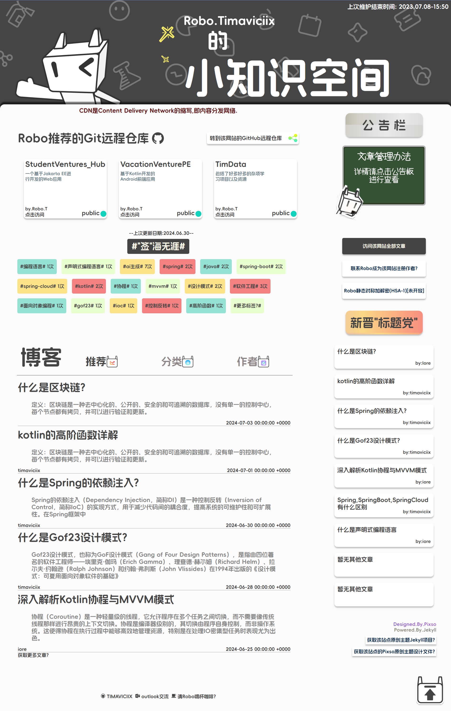
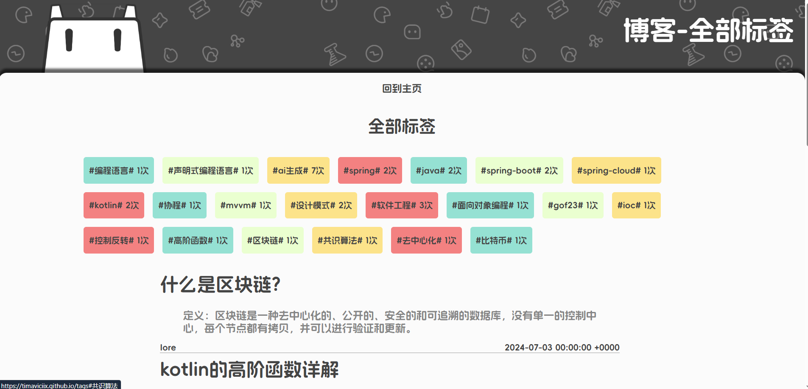
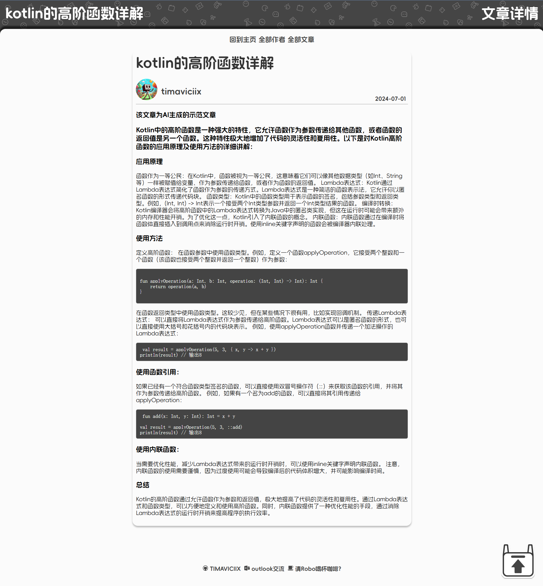
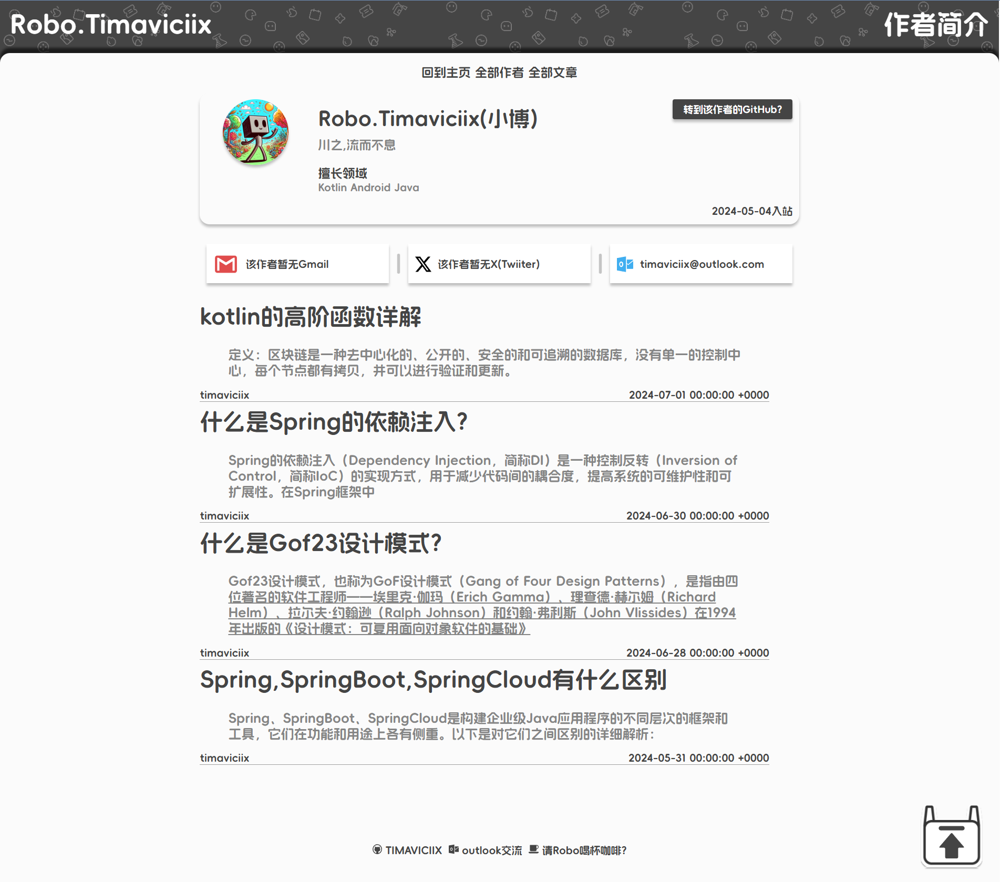

<div align="center">
  <font color="#3490de">🎉-“OPEN SOURCE” (computing)-&emsp;<b>开源中</b>&emsp;-“OPEN SOURCE” (computing)-🎉</font>
</div>

### Hi,这是"Robo的小知识空间"GitHub Pages个人博客的主题开源库

## 食用方式
### 1.通过git将该项目克隆到您的本地文件夹内
```
git clone git@github.com:TIMAVICIIX/timaviciix.github.io.git <Your Local Repository>
```
### 2.如果您正在使用RubyGems,您可以使用一下命令
```
//gemfile
gem 'Robo-knowledge-web-theme', '~> 1.0'
//install
gem install Robo-knowledge-web-theme
```

### 完成以上步骤后,请点击<a href="主题配置说明.md">"主题配置说明.md"</a>查看详细主题配置方式.

## 🎬界面展示🎬
#### 主页面


<br>

#### 标签页面


<br>

#### 文章页面


#### 作者页面



### 存在的问题及优化空间:
#### 1.该主题样式没有更好的呈现方式(花了一周左右写出来的,也是边学边写)
#### 2.内嵌Liquid语法复杂,如果不在拓展之前及时进行优化，项目很可能会慢慢高耦合
#### 3.Js与Jquery暧昧不清,在我写的脚本中，有一部分JQuery语法来得很突然
#### 4.未能呈现出UI设计稿的完美效果,我的期望是主页Robo的眼睛能够跟随光标移动的
#### 5.各设计以及代码编写层次的粒度比较模糊
#### 6.才想起来404页面和About页面没写呢

### 慢慢改善吧，罗马不是一天建成的

## 2024.07.09<br>Robo.Timaviciix
